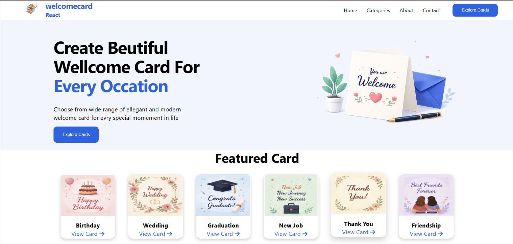
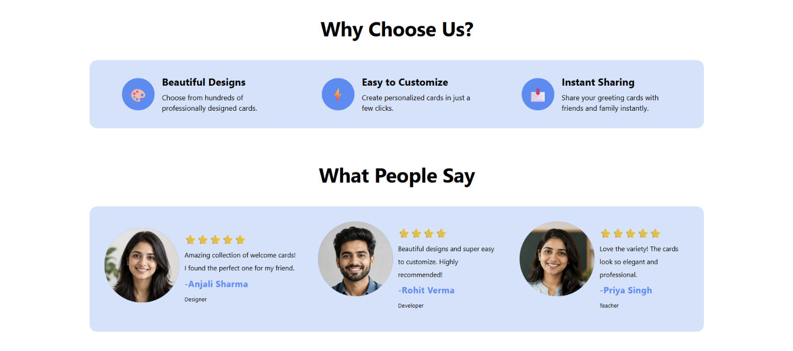
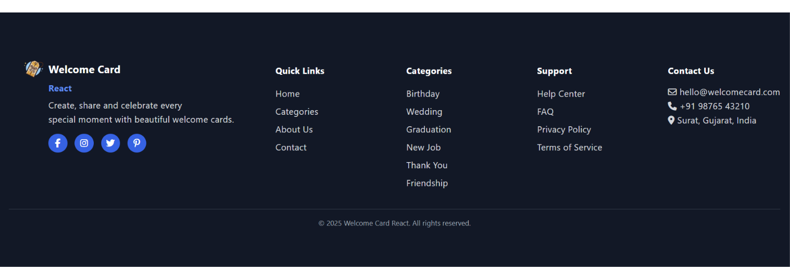

# 🎉 Welcome Card React

A modern and responsive greeting card website built with React and Vite.

## Features

- 🎂 Featured greeting cards
- 💍 Multiple card categories
- ⭐ Customer reviews
- 💙 Why Choose Us section
- 🎨 Modern UI

## Technologies Used

- React
- Vite
- CSS3
- Font Awesome

## Screenshots

## Installation

npm install
npm run dev

## What I Learned

This project helped me strengthen my React skills, including components, props, state, and CSS.
I also improved my debugging skills by solving errors during development. 
I used ChatGPT as a learning tool to understand concepts and fix issues, 
which helped me become more confident in React.

## Author

Rahul